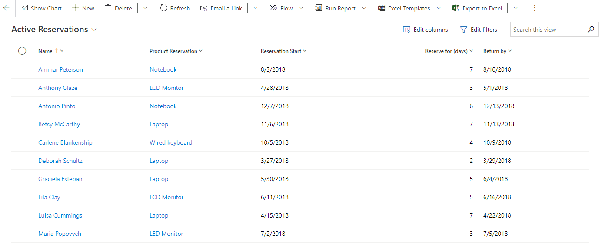
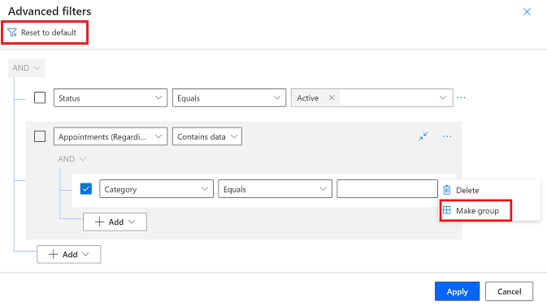
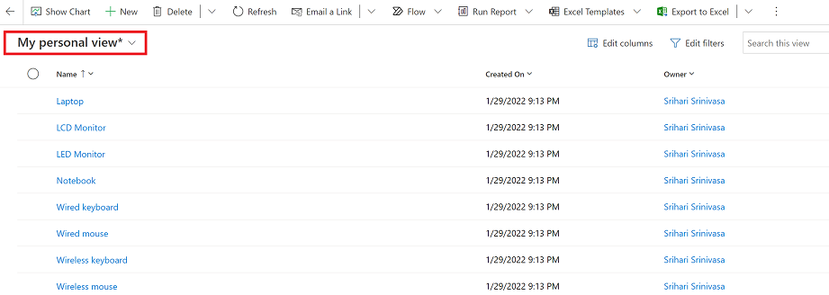

# Create and manage personal views on a grid page

The grid page in a model-driven app displays data in a view using the read-only grid control. Views are used to define how rows of a table are displayed in the app.

A view definition has the following elements:

- Columns to display, including the order and width
- Default sort order
- Filter conditions to show records that match the conditions

You can create and manage personal views on a grid page by editing any of these three elements of a view.

For more information, see [Understand model-driven app views](../maker/model-driven-apps/create-edit-views.md)

## Column editor

Use the column editor to add, remove, or re-order columns to see the right set of columns to help you get a clear view of your data. 

To edit a column on the grid page, select **Edit columns**.

 > [!div class="mx-imgBorder"]
 > 
   
The **Edit columns** pane appears and shows the list of columns in the order they appear in the current view. Follow these step to, edit the columns:

- To remove colums, select the More commands button (**…**) next to column name and then select, **Remove**. 
    
- To change the order of the columns, select the More commands button (**…**) next to column name and then select, **Move up** or **Move down**. Or, drag and drop a column to the desired position 

   > [!div class="mx-imgBorder"]
   > 

To add columns to the view, select **Add columns**. This brings up the **Add columns** pane that lists all the columns in the table that you can add to the view.

1. By default, you'll see the **Default** set of system columns in the table. Select the drop-down list, see **All** or **Custom** columns to choose from.
2. Use the **Search** to find a speicific column.
   
      > [!div class="mx-imgBorder"]
      > 
   
Select a column from the list to append it to the list of columns for the view.
   
To add colums from related tables, select the **Related** tab. You'll see the columns from  related table is in parentheses. Browse and expand the list and choose a related table column to add to the view. When you're done, select **Close** to review the list of added columns.

 

   
At any point, you can reset the list of columns to the ones in the view definition by choosing the **Reset to default** option. When you have reviewed the changes you made, select **Apply** to see the changes to the view on the grid page.

> [!div class="mx-imgBorder"]
> 

## Filter editor

Use the filter editor on the grid page to see the set of conditions in the current view. You can also add more conditions or remove conditions in filter data.

To remove a condition, select the More commands button (**…**) next to a row and then select, **Delete**.

Follow these step to add a conditions:

- To add a single condition, select **Add row**. Select a column, an operator, and a value to create a condition.
     
  

- To add a group of conditions, select **Add group**. You can create multiple sub-conditions and group them using AND or OR operators to create an expression.

   

- To add condition on a column from a related table selet, **Add related entity**. Then choose the related table you want to filter on and add conditions to it.

   > [!div class="mx-imgBorder"]
   > 
    
   > [!NOTE]
   > **Contains data** is the only conditional operator that can be used with a related table in a view filter.

- You can group conditions by first selecting a condition using the check box and then selecting the More commands button (**…**) next to a row, and then select **Make group**.   At any point, you can reset the conditional expression back to original state by choosing the **Reset to default** option.  When you have reviewed the changes you made, select **Apply** to see changes to the view data on the grid page.

   > [!div class="mx-imgBorder"]
   > 
   

## Create personal views

When you have edit a view using any of the three elements of the view definition an asterisk appears next to the view name, which means the view is not saved. 

> [!div class="mx-imgBorder"]
> 

Follow these steps to save the view:

- If you made changes to a system view or a personal view that you don't have *Write* permission to, then you can save the changes as a personal view. On the command bar select, the More commands button > **Create view** >, **Save as new view**.

> [!div class="mx-imgBorder"]
> 

- To save changes to a personal view that you have *write* permission to, then on the command bar select, the More commands button > **Create view** > **Save changes to current view**. 

> [!div class="mx-imgBorder"]
> 

### Modern advanced find

If your administrator has enabled the modern advanced find experience then you will find the options to create a personal view in the view selector:

- If you made changes to a system view, or a personal view on which you don’t have Write permission, you can save the changes as a personal view by choosing the **Save as new view** option at the bottom of the view selector.

  _GIF_

- If you made changes to a personal view on which you have Write permission, you will have the additional option **Save changes to current view** to save the changes to the current view at the bottom of the view selector.
 
  _GIF_

## Set default view

Each table in the model-driven app has a default view set by the system administrator. The default view for a table is indicated by the **Default** label in the view selector.

- You can make any view the default view selecting the **Set as default view** option at the bottom of the view selector.

   > [!NOTE]
   > **Set as default view** option in view selector appears only when the currently selected view is not the default view and when there are no unsaved changes.

  _GIF_
  
- You can reset the default view of a table by selecting the **Reset default view** option at the bottom of the view selector.

   > [!NOTE]
   > **Reset default view** option in view selector appears only when the default view for the table is not the one set by the system administrator.

  _GIF_

   > [!TIP]
   > The options at the bottom of the view selector are always visible, even if the list of views is longer than the available vertical screen space.
   
## Manage and share personal views

If your administrator has enabled the modern advanced find experience then you will see **Manage and share views** option at the bottom of the view selector. By selecting it, you can perform the following view management tasks on the grid page.

### Change sort order

By default, the list of views in view selector are grouped by personal views and system views, with each of the groups listing views ordered alphabetically by view name. You can set the order of views to one of three preset sorting options:

- **Personal before system, A to Z** (_Default_): All personal views ordered alphabetically appear above all system views ordered alphabetically.

- **System before personal, A to Z**: All system views ordered alphabetically appear above all personal views ordered alphabetically.

- **A to Z**: All views (system and personal) appear alphabetically in the view selector.

   > [!NOTE]
   > Personal views are indicated by the _user_ icon. You can also hover over the _info_ icon to understand whether a view is a personal view or a system view.

### Hide views

You can hide views from appearing in the view selector by using the **Hide** option in the view management panel. You can select the _eye_ icon that appears on hover or select the **Hide** option by choosing the **...** next to view name.

#### What is view hiding?

Hiding a view is a way to personalize the view list and reduce clutter by making views not be visible in the view selector. A view may be needed for a specific purpose periodically or a view could be shared with you that you may not need it anymore. In such instances, hiding enables you to manage your view list by seeing only the views that are most important for you.

Once a view is hidden, it will not appear in the view list for that table in all model-driven apps on all devices for you. If a view is shared with you and other team members, hiding that view will only hide the view for you in the view selector; it will not be hidden for everyone else who has access to the view.

   > [!NOTE]
   > - By default personal views can be hidden. You can hide system views only if the administrator has enabled the setting in Power Platform Admin Center.
   
   > - The default view of a table cannot be hidden.

   > - A view that is hidden cannot be set as default.

If a view is hidden, then you will see the option to toggle it back to make it visible. You can select the _eye_ icon that appears on hover or select the **Show** option by choosing the **...** next to view name.

### Other view management tasks

| Option | Use |
| - | - |
| **Set as default** | <ul> <li> Make a view the default view for that table across all model-driven apps in the environment. </li> <li> **Set as default view** option does not appear on a hidden view or on a view that is already default.</li></ul> |
| **Reset default** | Reset the default view of a table across all model-driven apps in the environment. |
| **Share** | <ul> <li>Share the view with other members of your organization by selecting the team/user to share it with and defining permissions. For more information, see https://docs.microsoft.com/en-us/powerapps/user/share-row. </li> <li> Appears only on personal views for which you have share permission. </li></ul>|
| **Edit info** | <ul> <li>Edit the name and description of the view </li> <li> Appears only on personal views for which you have Write permission. </li></ul>|
| **Assign** | <ul> <li>Assign view ownership to another user to team in your organization </li> <li> Appears only on personal views that you own. </li></ul>|
| **Delete** | <ul> <li>Delete the view </li> <li> Appears only on personal views for which you have Delete permission.</li> <li> Deleting a personal view will delete the view for all users who have shared access to it.</li></ul>|
| **Deactivate/Activate** | <ul> <li>Deactivate/activate the view </li> <li> Appears only on personal views for which you have Write permission.</li> <li> Deactivating/activating a personal view will make it inactive/active for all users who have shared access to it.</li></ul>|

[!INCLUDE[footer-include](../includes/footer-banner.md)]
