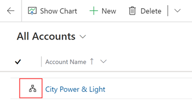
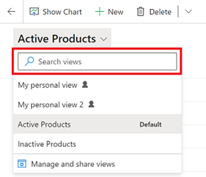
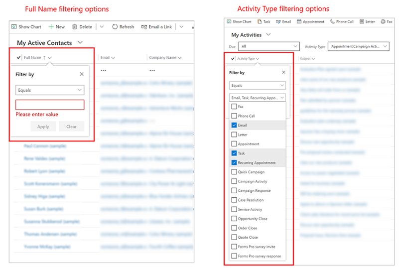

# Explore data in a view on a grid page

In model-driven apps, the read-only grid is the default control used to represent rows of data in tabular form. When a model-driven app has a table as a subarea in the sitemap the default layout of the page, called the grid page, has a command bar, a view switcher, and a grid.

<Picture of grid page with command bar, view switcher, edit columns, edit filters, search, grid and jump bar highlighted>

## Navigation

You can choose a cell under the primary column to navigate to the record page from the grid page.

When you filter data on a grid, the grid page remembers the filter, sort order, and the page state when you navigate away and then return to the page. This works the same way when data is filtered through search, column filtering or pagination.

   > [!div class="mx-imgBorder"]
   > 

On grids of tables that support hierarchy relationships, you can select the hierarchy icon to navigate to the hierarchy view.

   > [!div class="mx-imgBorder"]
   > 

You can also right-click like a cell value in the primary column or a lookup column to open in a new tab or window.

   > [!div class="mx-imgBorder"]
   > 

## View switcher
  
The view switcher at the top of the page contains all the views of the table you have access to, so you can see the data in the view. By default, the list of views is grouped by personal views and system views, with each of the groups listing views ordered alphabetically by view name.

<PIC of view switcher>

### Modern advanced find

If your administrator has enabled the modern advanced find experience, you will see a flat list of views with personal views indicated by the <user> icon. You can hover over the info icon to understand whether a view is a personal view or a system view. The ordering of views in the list depends on the preset sort order you have chosen, with personal views (ordered alphabetically) over system views (ordered alphabetically) the default. For more information on how you can change the sort order, see <Link to section>

You can use the search box at the top of the view switcher to quickly search for a view.

The default view for a table is set by the administrator and is indicated by the Default label in the view list. You can set a view to be the default view or reset the default to the one chosen by the administrator at any time. For more information, see <Link to section>

<GIF of view switcher>

## Column editor

You can use the column editor by selecting the Edit columns option. This enables you to add, remove and re-order columns, so you have all the right columns for reviewing your data. For more information, see <Link to section>

<PIC of Edit columns>

## Filter editor
When you select the Edit filters option on the grid page, you can see the set of conditions in the current view. You can add more conditions or remove conditions to filter data. This enables you to apply the right filters on your data. For more information, see <Link to section>

<PIC of Edit filters>

## Grid search

Teh search box on a grid page may have one of two types of searches as configured by your administrator.

### 1. Search this view

When you use the **Search this view** option on a grid page, the system searches for data in the view that you're currently in. In the following example, you perform a search on the **Contacts** grid.

1. Go to the **Contacts** grid, and then select **My Active Contacts** from the list of views.

    > [!div class="mx-imgBorder"]
    > 

2. Select **Search this view** to search for data in the view you're in.

    > [!div class="mx-imgBorder"]
    > 

The system searches for data in the **My Active Contacts** view and displays search results by using the same set of columns that are used in your current view.

   > [!div class="mx-imgBorder"]
   > 

### 2. Quick find

If your administrator has enabled the use of quick find view of a table for searching on grids and sub-grids, you will see the **Quick find** option on the grid page. When you use it, the system searches for data in the quick find view of the table and displays results in the columns of the quick find view and not of the current view. 

## Column filters
  
You can choose from many different filtering options for a column in a grid. The type of data in the column determines what filter options are available. For example, the **Full Name** column in the **Contacts** grid page has different filter options than the **Activity Type** column in the **Activities** grid page.
 
> [!IMPORTANT]
> In Unified Interface, grids don't prepopulate column filters based on the current view definition.

   > [!div class="mx-imgBorder"]
   > 

### Filtering on a lookup column
 
When you filter on a lookup column, you can select from a list of rows to filter by rather than manually typing in the data. For example, on a **Primary Contact** lookup column, you can select the contact name from the list of rows to filter by.

The filter on a lookup column helps you complete the search by suggesting results inline. These results are based the table being looked up and will include all rows with no filter.

   > [!div class="mx-imgBorder"]
   > 

### Filtering on a date column

The robust **Date** filter includes many different values to choose from, such as **On** to search by an exact date, or **Next X fiscal year** or **In fiscal period** to search by year or quarter.

   > [!div class="mx-imgBorder"]
   > 
  
### Filtering activities

You can filter the list of activities to see only the ones you're interested in. For example, you can further limit the activities you are seeing in a view by using the activity type filter. The activity type filter allows you to filter activities based on the type, such as email, task, phone call, and so on.

   > [!div class="mx-imgBorder"]
   > 

## Jump bar
The jump bar on a grid page can be used to access rows beginning with a particular character easily. The jump bar acts on the first sorted column in the view. If no change has been made to the sort order, the jump bar uses the primary column.
 
   > [!div class="mx-imgBorder"]
   > 

[!INCLUDE[footer-include](../includes/footer-banner.md)]
