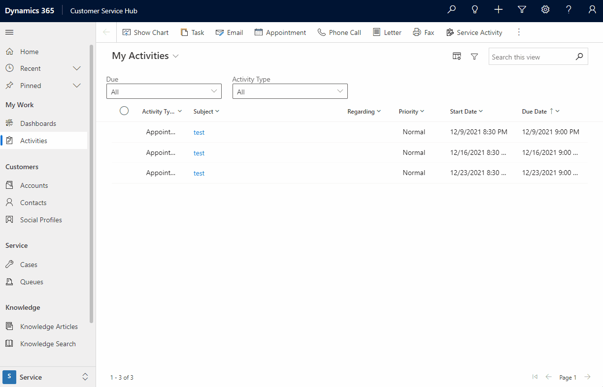

# Create and join a Teams meeting from an appointment (preview)

You can now create a Teams meeting and then join the meeting from the appointment.

> [!NOTE]
> - This is a preview feature. Your system administrator needs to turn on the Collaboration feature called **End users can add and join Teams meeting from appointments in model-driven apps**  in your environment. For information, see [Manage feature settings](/power-platform/admin/settings-features).
> - When this feature is enabled, the description field in an appointment also supports editing and viewing in rich text.

## Add a Teams meeting to an appointment activity

1. Open or create an new appointment. 
2. In the **Details** section, set the **Teams meeting** toggle to, **Yes**.
3. When you're done, select **Save**.

## Join a Teams meeting from an appointment

1. Open a appointment activity. 
2. Choose one of the following ways to join the meeting:
     - On the command bar select, **Join Teams Meeting**.
     - From the **Details** section, select the **Join Teams Meeting** link. 
     - Scroll down the **Description** section of the appointment and select, **Click here to join the meeting**.
3. Select how you want to the Teams meeting.

