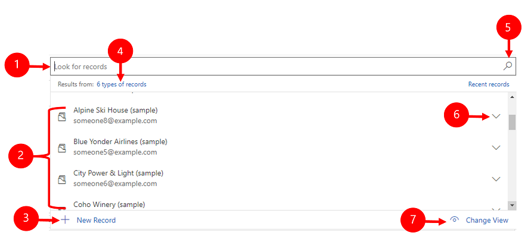
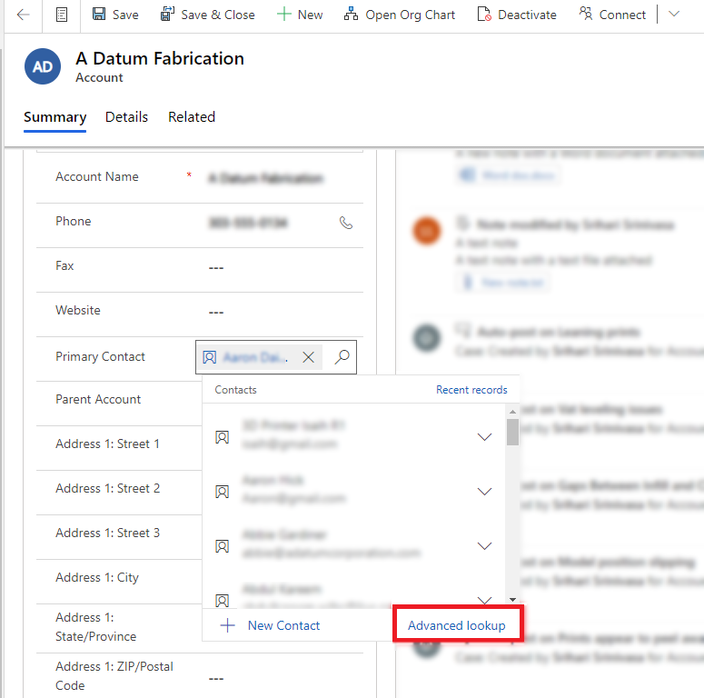
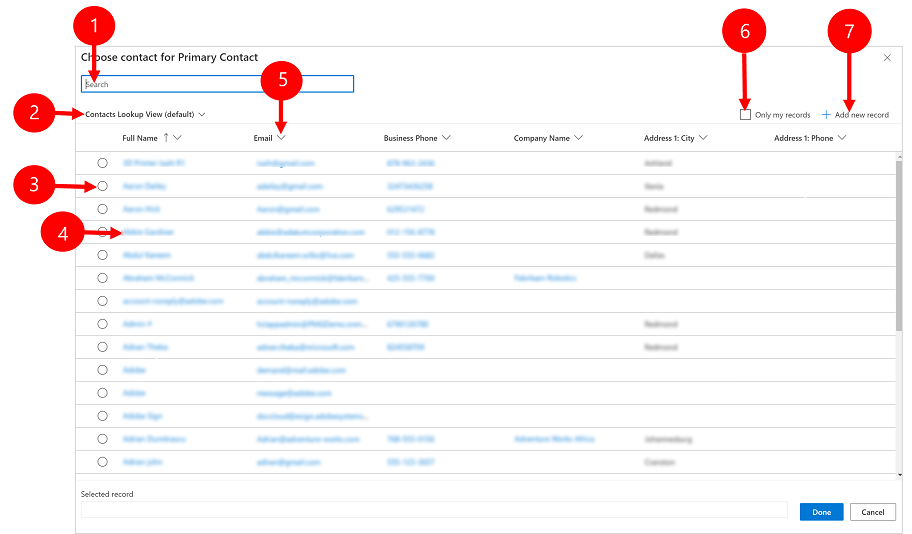
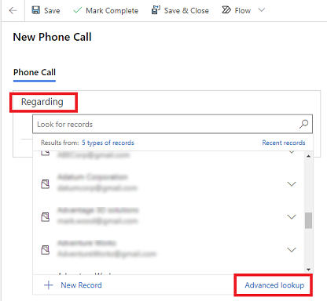
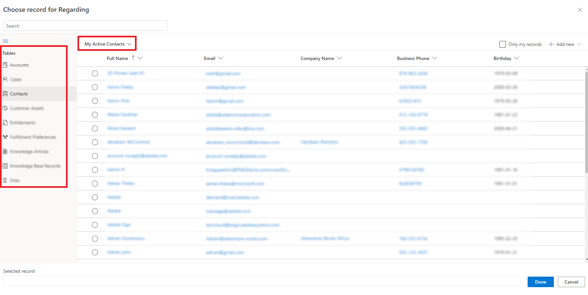
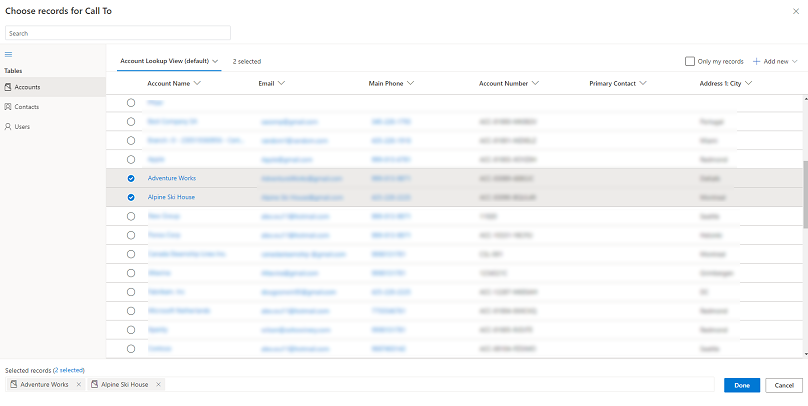
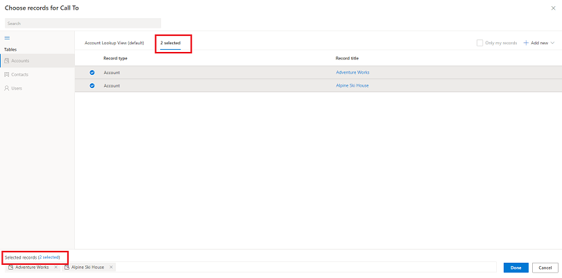
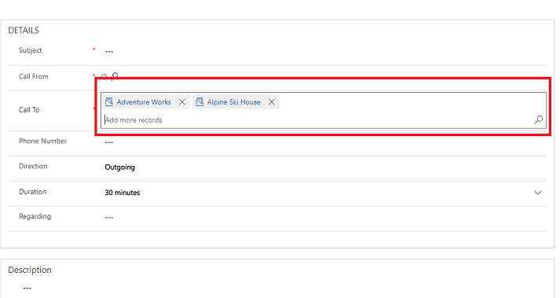

#  Use the lookup column on a row

Lookup helps you to choose rows from a related table. When you select a related table and enter search criteria, such as a name or email address, lookup automatically begins to resolve the partial text and displays any matching rows. If no rows are displayed after you have typed the full text of your search criteria, a message is displayed specifying that there are no rows.

For example, you might search for the name **Adrian Dumitrascu**. When you type **ad**, possible matching rows are automatically populated and displayed.

  > [!div class="mx-imgBorder"]
  > 
  
>[!NOTE] 
>An administrator can define the criteria that lookup uses for resolving partial search text.

Also, you can create a new row by selecting the **New** button. You must have sufficient permissions to view the **New** button and create a row. When you select the lookup column, the five most recently used rows are displayed along with five favorite rows. Which rows are displayed depends on your view history and the favorites you’ve pinned. 

For example, if there's only three rows in your history, then the lookup will display those three rows,
along with seven of your favorite rows. If you haven't pinned any rows to favorites, then the most recently viewed rows will be displayed.

  > [!div class="mx-imgBorder"]
  > 

Legend

1. **Look for records**: Select the textbox and type your search criteria to look for rows.
2. **Recent**: Rows that were recently searched.
3. **New Record**: Create a new row. 
4. **Types of records**: Select to filter by a table type such as Contact table or Account table. The number infront of **type of records** represents how many table are available to filter from.
5. **Browse in a lookup column**: To browse a lookup, select the lookup icon (magnifying glass). A full list of items will be shown in the dropdown.
6. **Expand item**: Use the Right and Left arrow keys on your keyboard to expand collapse each item. 
7. **Change View**: Select to switch to another view. For more infomation on views, see 

## Types of lookups

Lookups are classified into the following: 

- **Simple lookup:** Select a single row from a single table.

- **PartyList-type lookup:** Use to select multiple rows from multiple tables in a lookup. Use partylist-type columns to select multiple rows. This allows you to add each row by performing a new search, multiple times. Every time you select a row, you will be able to perform a new search for another row. Note, you can't customize the system and disable views for PartyList-type look.
  
- **Regarding-type lookup:** Use to select a single row from multiple tables in a lookup. Activities must be enabled for a table to use the Regarding lookup. For more information: [Enable activities for a table](../maker/data-platform/types-of-entities.md#enable-activities-for-a-table)

## Search in a lookup column 
To search a lookup, select the textbox and type your search criteria. If recent rows are enabled for your lookup, your recent rows will be displayed when you select the textbox.

  > [!div class="mx-imgBorder"]
  >   
  
>[!NOTE]   
> The default search result for lookup search is, **begins with**. This means results include rows that begin with a specific word. For example, if you want to search for **Alpine Ski House**, type **alp** in the search box; if you type **ski**, the row will not show up in the search result.
>
> For a wildcard search use asterisks: For example, type \*ski or \*ski\*.

## Browse in a lookup column
To browse a lookup, select the lookup icon (magnifying glass). A full list of items will be shown in the dropdown.

  > [!div class="mx-imgBorder"]
  >   
 
## Most recently used row type images
The most recently used list of rows shows an image to help distinguish between row types.

>[!NOTE] 
>Recent rows are not filtered by search term, selected view or related rows.

  > [!div class="mx-imgBorder"]
  >   
  
## Row type selection list  
When results span multiple row types, you can see how many types of rows there are and select them from the list. The **Lookup Row** option is not available in Unified Interface. Instead, use the following to search:

- To look for rows, enter text in the search box. 
- To search by table type select **types of rows**. 
- Select **Change View** to select a view.

  > [!div class="mx-imgBorder"]
  >   
  
  
## Create a new row if you don’t find an existing row

If you do not find a row, select **New** in the lookup area to create a new row. When the row is created it will show up in the lookup. 

### Replace the selected lookup item

You can replace an existing row while using simple and regarding-type lookups. Search for a row and then select the row to replace it with a new row.

### Change a view in a lookup column 

Selecting **Change View** lets you determine:
 - How you want to view rows such as **Contacts Being Followed**, **Contacts Lookup View**, or **Active Contacts**.
 - What you want to view in the rows, such as name, email, or telephone number. For example, if you want to view only the contacts that you follow, select
    **Change View** \> **Contacts being followed**. Only the contacts that you are following will be displayed, as illustrated here. 

    

### Filter by, Only my rows or Filter by related primary contact

To apply extra filters, in the **Change View** menu, select **Only my rows** or **Filter by related Primary Contact**.

### Choose from multiple rows

When lookup has more rows in a column than can fit in the available display area, the display area is collapsed—that is, the rows that do fit the display area are shown next to the number of rows that are not shown. To view all rows, select the number. The following images show the difference between collapsed and non-collapsed columns.

**Collapsed:**

**Non-collapsed:**

## Advanced lookup

To use **Advanced lookup**, your administrator needs to enable this feature. For more information, see [Manage behavior settings](/power-platform/admin/settings-behavior).

Once enabled **Advanced lookup** is available on any lookup column that's on a quick create form, edit form, or dialog box. With **Advanced lookup** you can easily sort rows and switch between tables or views in a lookup column. 

Advanced lookup supports customizations on lookup control through Client APIs such as *addCustomView*, *addCustomFilter*, *addPreSearch* and *removePreSearch*. 

1. To use **Advanced lookup**, select the lookup icon (magnifying glass) on any lookup column and then select **Advanced lookup**. 

   > [!div class="mx-imgBorder"]
   >   

2. The **Advanced lookup** gird opens with a list of rows.

   > [!div class="mx-imgBorder"]
   >   

Legend

1. **Search**: Enter search text to find the row that you're looking for. When you changes views the search text is retained. 
2. **Change views**: Select to change views.
3. **Select row**: Select the radio button to choose a row for the lookup and then select **Done**. The selected row will appear at the bottom under **Selected record**.
4. **Open row**: Select to open the row and make edits and then save your changes. Any saved changes are reflected in the advanced lookup grid.
5. **Sort**: Select the arrow at the top of any column to sort in ascending or descending order. 
6. **Only my records**: Select to only show rows that you own.
7. **Add new record**: Opens the quick create form where you can add a new row for the table. When you save the new row, the advanced lookup grid will refresh and show the newly added row.

### Regarding advanced lookup

In a **Regarding** lookup, you can switch between tables and their views

1. In a **Regarding** lookup column, select the lookup icon (magnifying glass) then select **Advanced lookup**. 

   > [!div class="mx-imgBorder"]
   >   

2. On the advanced lookup grid, select a table from the list to see rows for the selected table. You can also select the current view to change views.

   > [!div class="mx-imgBorder"]
   >   

### Party list advanced lookup

For lookup columns that is a party list, you can select multiple rows from different tables such as the **Call To** field on a phone call activity.

1. Go to a lookup column with party list and select the lookup icon (magnifying glass) then select **Advanced lookup**. 
2. On the advanced lookup grid, select from multiple rows from different tables.

   > [!div class="mx-imgBorder"]
   >   

3. Select the **(number of rows) selected** tab or the link at the bottom to review and edit your choices and then select **Done**.

    > [!div class="mx-imgBorder"]
    >   
   
4. The selected rows appear in the lookup.

   > [!div class="mx-imgBorder"]
   >   

[!INCLUDE[footer-include](../includes/footer-banner.md)]
