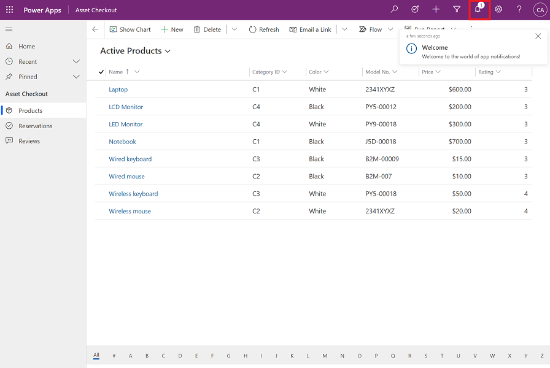

# Preview: In-app notifications in model-driven apps 

[!INCLUDE [cc-beta-prerelease-disclaimer](../includes/cc-beta-prerelease-disclaimer.md)]

In-app notifications allow you to receive notifications in the notification center of your model-driven app. Notifications are stored in the notification center until you dismiss them or when they expire. By default, notifications expire in 14 days but you system administrator can modify the expiration setting.

> [!IMPORTANT]
> - This is a preview feature, and isn't available in all regions. Your administrator needs to enable [early access](/power-platform/admin/opt-in-early-access-updates) to use the new app notifications feature.
> - [!INCLUDE[cc_preview_features_definition](../includes/cc-preview-features-definition.md)]

When you start using an app on the web or Power Apps mobile the system checks for new notifications and displays any new notifications. Notifications are at the organization level which means you see notifications regardless of the app your using.

## Notification center

- The notification bell icon shows the count of new notifications. When you open the notification center the count is cleared. To access your notifications, select the bell icon on the nav bar. 

  > [!div class="mx-imgBorder"] 
  >   

- To dismiss and delete a notification, select the close **X** button on a notification. Or, select **Dismiss all** to dismiss and delete all notifications. 

  > [!div class="mx-imgBorder"] 
  >   

## Toast notifications

Toast notifications appear temporarily to the left edge of the application. When multiple notifications appear, they are stacked. When more than three toast notifications are received at a time, you'll see toast which indicates that there's more notification for you to see in the notification center.

> [!div class="mx-imgBorder"] 
>   

Your system administrator can enable or disable toast notifications. If toasts are enabled, you can turn them off at a user level. Regardless of the toast being shown, all notifications can be accessed from notification center.

1. To enable or disable toast notifications in the notification center, select **Settings** 

 > [!div class="mx-imgBorder"] 
 >   

2. To enable or disable toast notifications, do one of the following:

    - **To enable toast notifications**: Move the toggle to **On** and then enter how many seconds the toast will show. 
    - **To disable toast notifications**: Move the toggle to **Off**.
   
       > [!div class="mx-imgBorder"] 
       >   
   
 3. When you're done, select **Save**.  

## See also

[In-app notifications on Power Apps mobile](../mobile/mobile-notifications.md)
[Send in-app notifications-TBD](../maker/model-driven-apps/send-in-app-notifications.md)
