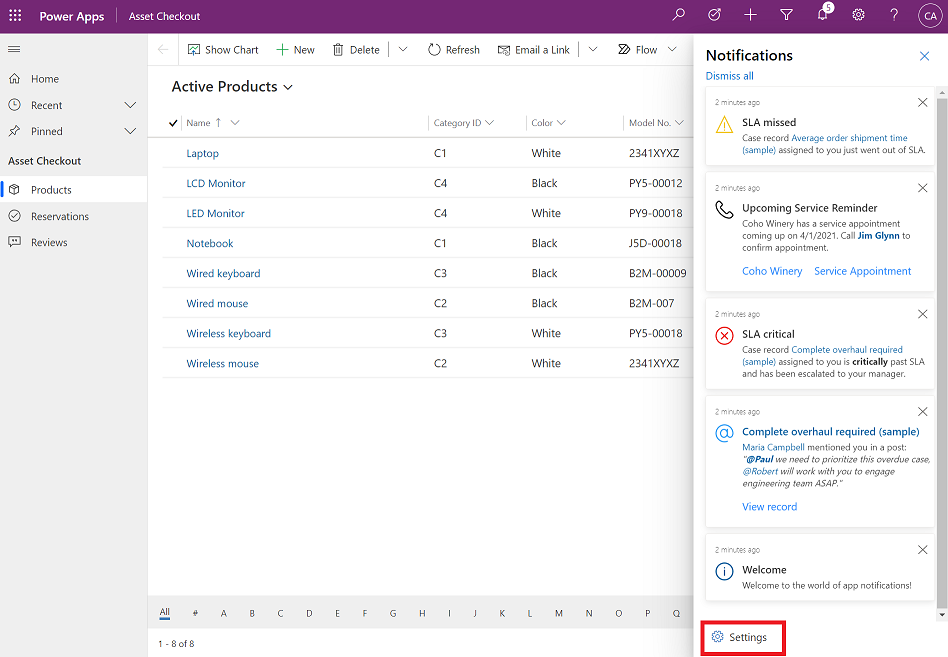

# Preview: How notifications work in model-driven apps 

[!INCLUDE [cc-beta-prerelease-disclaimer](../includes/cc-beta-prerelease-disclaimer.md)]

App notifications allow users to receive notifications in the notification center and optionally as a toast notification. Each notification is sent to a specific user and is only shown to the user when the web or mobile app is running. Notifications are stored for the user until they are dismissed by the user in the notification center or expire. This allows them to be received even if the user is not using the app.  

> [!IMPORTANT]
> - This is a preview feature, and isn't available in all regions. Your administrator needs to enable [early access](/power-platform/admin/opt-in-early-access-updates) to use the new app notifications feature.
> - [!INCLUDE[cc_preview_features_definition](../includes/cc-preview-features-definition.md)]

The model-driven app polls the system for new notifications to be shown to the user.  The polling is done when the model-driven app starts and when a navigation happens as long as it has been more than one minute since the last check.  Notifications are at the org level which means a user can see notifications regardless of the app they are using.

## Notification center

The notification bell icon shows the count of new notifications and the count is cleared once the notification center is opened. To access your notification, select the bell icon on the nav bar. 

 > [!div class="mx-imgBorder"] 
 >   

To dismiss and delete a notification, select the close **X** button on a notification. Or, select **Dismiss all** to dismiss and delete all notifications. Your system administrator can set when notification expire by default they will expire in 14 days.

 > [!div class="mx-imgBorder"] 
 >   

## Toast notifications

Toast notifications appear temporarily to the left edge of the application. When multiple notifications appear, they are stacked. When more than three toast notifications are received at a time, a toast indicates that there are more in notification center.

> [!div class="mx-imgBorder"] 
>   

The notification’s sender or system administrator can indicate if toasts are enable for notification. If toasts are enabled, you can trun them off at a user level. Regardless of the toast being shown, all notifications can be accessed from notification center.

1. To enable or disable toast notifications, in the notication pane, select to the **Settings** 

 > [!div class="mx-imgBorder"] 
 >   

2. To enable or disable toast notifications, do one of the following:

    - **To enable toast notifcations**: Move the toggle to **On** and then enter how many seconds the the toast will appear for. 
    - **To disable toast noficatoin**: Move the toggle to **Off**.
   
       > [!div class="mx-imgBorder"] 
       >   
   
 3. When you're done, select **Save**.  

## Notifications in Power Apps mobile

The notification toast will appear one at a time instead of stacking like the web player experience.

To access notifications in Power Apps mobile, select the bell icon on the site map. 

> [!div class="mx-imgBorder"] 
>   
   

## See also

[Send in-app notifications-TBD](../maker/model-driven-apps/send-in-app-notifications.md)
