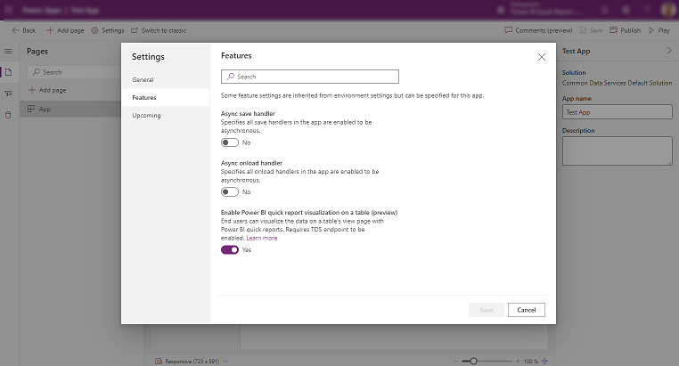
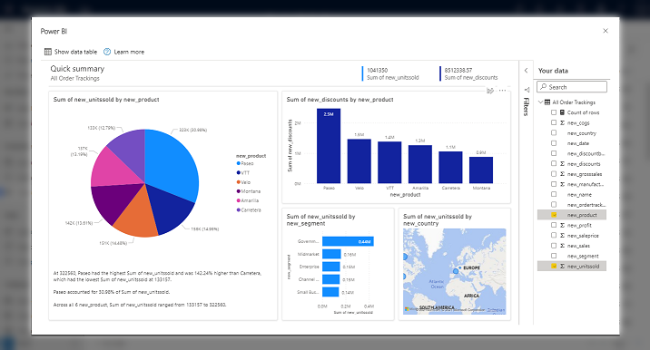

# Visualize your data in a view with Power BI service (preview)

[This topic is pre-release documentation and is subject to change.]

You can create reports in the Power BI service starting with the data that in a view of your model-driven app. Power BI automatically generates the visuals for you, so you can explore the data with just a few clicks.

If you're new to Power BI reports and need more information, see [Reports in Power BI](/power-bi/consumer/end-user-reports).

If you're using Power BI Desktop, you can also [create a report using data from Dataverse in Power BI Desktop](/powerapps/maker/data-platform/data-platform-powerbi-connector).

> ![IMPORTANT]
> Your administrator needs to turned on the **Enable Power BI quick report visualization on a table (Preview)** feature setting, to use the capabilities in your model-drive apps that's covered in the topic. For more information, see [Manage feature settings](/power-platform/admin/settings-features).

   > [!div class="mx-imgBorder"]
   > 

## Visualize in Power BI

1. In your model-driven app, select a table and then on the command bar, select **Visualize this view**.

   > [!div class="mx-imgBorder"]
   > 

2. You can see a Power BI-generated visualization of the data in the view, based on the view definition. That is, the filters acting on the view are automatically applied to the Power BI visualization. A subset of columns that are part of the view are used to auto-generate the Power BI visuals.

   > [!div class="mx-imgBorder"]
   > 

   The full set of view columns are available in the Power BI report to be used to change the data you see in the report.

   > [!div class="mx-imgBorder"]
   > 

For more information on how you can interact with this visualization, see [Visualize your data quickly from Power Apps and Dynamics 365 apps (Preview)](LINK TBD).

## Licensing considerations

Anyone can use the **Visualize this view** feature to explore the data in a view, but to use the full edit experience, publish reports, access reports that others have published, or delete reports, you need a Power BI Pro license. If you don't currently have a Pro license, you can [buy a Power BI Pro license or start a free trial](/power-bi/fundamentals/service-self-service-signup-purchase-for-power-bi).

## Known issues and limitations

1. The first time you visualize the data in a view, creating the dataset and report can take some time. We're working to improving this performance experience.

2. Columns are indicated by their logical names rather than the display name. We're working on updating this experience, so the columns' display names are in the Power BI report.

3. This feature isn't supported for guest users in a tenant.
